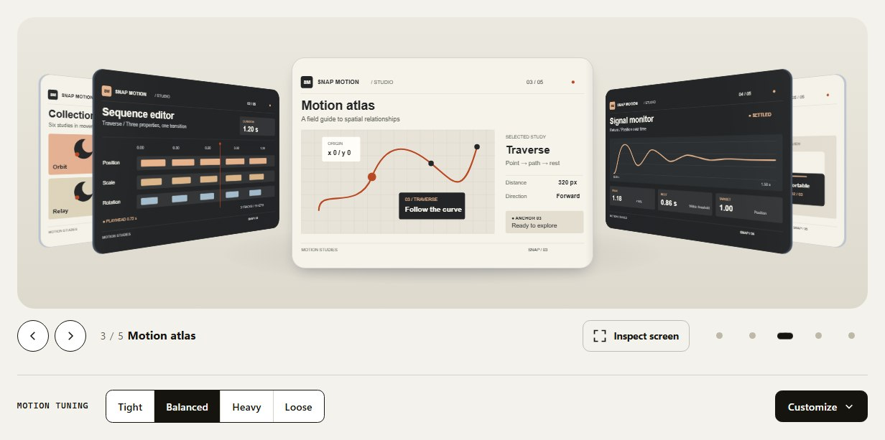

# Snap Motion

**Motion you can interrupt and tune.**

Snap Motion builds interactive surfaces that keep responding while they move. Grab a moving card,
reverse a drag or choose another destination: the next movement starts from the current physical
state.

The Playground brings five demonstrations together on one scrollable page. Browse, drag, zoom and
compare motion settings without leaving the experience.

**[Explore the Playground locally →](#run-it-locally)**

[](#run-it-locally)

_A still from the Playground: original Studio illustrations with live motion controls._

## What makes the motion interesting

**Direct manipulation.** A drag updates the underlying motion state as your pointer moves. Release
velocity helps choose where the surface goes next. Grab it again during settlement and continue from
its current position.

**Spatial relationships.** Coverflow carries focus along a continuous rail with perspective and
depth. Stacked Deck makes room for a card to pass before exchanging its depth in the pile. Position,
order and occlusion are part of the interaction.

**Parameters you can feel.** Compare Tight, Balanced, Heavy and Loose, then customize stiffness,
damping, mass, release projection and elastic boundaries. All five surfaces share one configuration;
a spring-response preview helps connect a value to its effect.

## Explore the surfaces

| Demonstration          | What to try                                                                          |
| ---------------------- | ------------------------------------------------------------------------------------ |
| **Coverflow**          | Move through a rail of screens, bring one forward and reverse before it settles.     |
| **Stacked Deck**       | Exchange cards with Shuffle or Direct, then interrupt a pass or change direction.    |
| **Paged Grid**         | Browse a collection in pages and change its rows, columns and spacing.               |
| **Gallery / Lightbox** | Browse illustrations in a native modal, navigate with keys, zoom in and pan.         |
| **Sheet**              | Open from any physical side, move between snap points and scroll the content inside. |

The Playground combines reusable package surfaces with application compositions. The
[component guide](docs/components.md) documents the public exports behind the demonstrations.

## Between input and rest

Snap Motion is a personal engineering project by [Maikel Eckelboom](https://github.com/maikeleckelboom).
A hand changes direction while a card is still airborne, or the selected item changes before its
surface has caught up. This project explores how interactions can remain responsive, spatially
coherent and understandable across browsers and input methods.

## How it works

The TypeScript foundation separates an item's semantic identity from its animated position. An
application can own the selected item while the surface is still travelling towards it, without
guessing selection from pixels.

- **`@snap-motion/core`** handles geometry, motion state, target selection and interaction policies
  independently of Vue and the DOM.
- **`@snap-motion/vue`** connects those mechanics to reusable Vue surfaces, with keyboard behavior,
  focus management and reduced-motion support.

The Playground presents the interactions. The engineering **Lab** provides deeper diagnostics,
configuration experiments and certification fixtures. Both use the same underlying packages.

Verification combines unit and component tests with browser interactions in Chromium, Firefox and
WebKit. It covers pointer and keyboard behavior, responsive layouts, Vue Router and Nuxt integration,
and consumers built from actual packed packages. See the [test architecture](docs/test-architecture-and-performance.md)
and [certification scope](docs/production-certification.md); automated coverage does not establish
complete accessibility or physical-device certification.

## Run it locally

Use the Node version in [`.node-version`](.node-version) and the pnpm version pinned in
[`package.json`](package.json). The integrated Playground currently lives on `dev`:

```sh
git clone --branch dev https://github.com/maikeleckelboom/snap-motion.git
cd snap-motion
pnpm install --frozen-lockfile
pnpm dev
```

Open **`/playground/`** at the address Vite prints, normally
[http://127.0.0.1:5173/playground/](http://127.0.0.1:5173/playground/). The root address opens the Lab.
Development runs directly from workspace source, so no package build is needed first.

For implementation details, start with the [component API](docs/components.md),
[integration guide](docs/integration.md) and [motion tuning](docs/tuning.md).

## Project status

The source is public. The reusable Core and Vue packages remain private beta candidates and are
**not published to npm**. The Playground is being prepared for public deployment; a dedicated
VitePress documentation site is planned for a later milestone. Current guides live in [`docs/`](docs).

## Contributing and license

See [Contributing](CONTRIBUTING.md) for development and validation agreements. Architecture and
public-contract changes should be discussed before implementation.

Snap Motion is licensed under the [MIT License](LICENSE).
